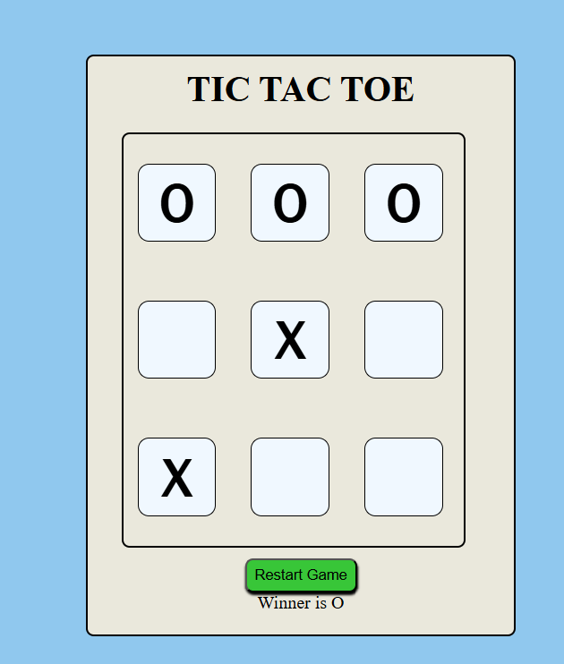

# Tic Tac Toe Game
A classic Tic Tac Toe game implemented using HTML, CSS, and JavaScript. This interactive web-based game allows two players to compete against each other on a 3x3 grid.

Features
Two-Player Gameplay: Play against a friend on the same device.

Winning Logic: Detects win conditions (rows, columns, diagonals).

Draw Detection: Identifies when the game ends in a draw.

Reset Functionality: Easily restart the game.

Simple UI: Clean and intuitive interface for easy gameplay.

Technologies Used
HTML5: Structures the game board and controls.

CSS3: Styles the game board, cells, and provides visual feedback.

JavaScript: Implements the game logic, handles player turns, checks for wins/draws, and updates the display.

How to Play
To play the game, follow these simple steps:

Open index.html:
Simply open the index.html file in your preferred web browser.

Start Playing!

Players take turns clicking on an empty cell.

The first player to get three of their marks in a row (horizontally, vertically, or diagonally) wins.

If all cells are filled and no player has won, the game is a draw.

Click the "Reset" button to start a new game.

Screenshot

Future Enhancements (Optional Ideas)
Add a single-player mode against an AI opponent.

Keep track of scores for multiple rounds.

Implement different board sizes (e.g., 5x5).

Add sound effects for moves and wins.

Improve visual animations for wins.

License
This project is open-source and available under the MIT License.